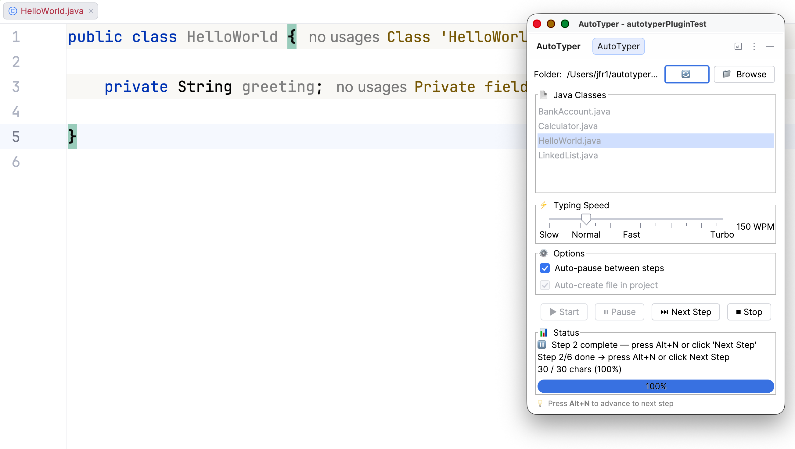

# ⌨️ AutoTyper - IntelliJ Live Coding Simulator

[](https://plugins.jetbrains.com)
[](LICENSE)
[](https://www.jetbrains.com/idea/)

**Simulate realistic, structured typing of Java classes in the IntelliJ editor — perfect for live coding demonstrations in lectures and presentations.**

Instead of typing code line-by-line from top to bottom, AutoTyper types code in the **natural development order** — just like a real developer would write it.



---

## ✨ Features

| Feature | Description |
|---------|-------------|
| 📝 **Step Markers** | Define typing order with simple `// @step N` comments |
| 📁 **Auto File Creation** | Automatically creates the Java file in the correct package directory |
| 📦 **Package-Aware** | Detects `package` declarations and creates proper directory structure |
| ⌨️ **Alt+N Shortcut** | Global shortcut to advance to next step (works even with editor focus) |
| ⚡ **Adjustable Speed** | From 30 WPM (slow demo) to 600 WPM (turbo) |
| ⏸️ **Auto-Pause** | Pauses between steps so you can explain |
| 🎯 **Natural Feel** | Randomized delays simulate real human typing |
| 📊 **Progress Indicator** | Shows current step and character progress |

---

## 🚀 Installation

### From JetBrains Marketplace (recommended)

1. In IntelliJ IDEA: `Settings` → `Plugins` → `Marketplace`
2. Search for **"AutoTyper"**
3. Click **Install** → Restart IntelliJ

### From ZIP (manual)

1. Download the latest release ZIP from [Releases](https://github.com/rolfjufer/autotyper-plugin/releases)
2. In IntelliJ: `Settings` → `Plugins` → ⚙️ → `Install Plugin from Disk...`
3. Select the ZIP → Restart IntelliJ

### Build from Source

```bash
git clone https://github.com/rolfjufer/autotyper-plugin.git
cd autotyper-plugin
gradle buildPlugin
# Output: build/distributions/autotyper-plugin-*.zip
```

---

## 📝 How Step Markers Work

Add `// @step N` comments to define the typing order:

```java
// @step 1
package ch.demo;

// @step 1
public class BankAccount {

// @step 2
    private String owner;
    private double balance;

// @step 3
    public BankAccount(String owner) {
        this.owner = owner;
        this.balance = 0.0;
    }

// @step 4
    public void deposit(double amount) {
        if (amount <= 0) {
            throw new IllegalArgumentException("Amount must be positive!");
        }
        balance += amount;
    }

// @step 5
    public void withdraw(double amount) {
        if (amount > balance) {
            throw new IllegalStateException("Insufficient funds!");
        }
        balance -= amount;
    }

// @step 6
    public static void main(String[] args) {
        BankAccount account = new BankAccount("Alice");
        account.deposit(1000);
        account.withdraw(250);
        System.out.println("Balance: " + account.balance);
    }

// @step 1
}
```

### How it types

| Step | What happens |
|------|--------------|
| 1 | Types the class skeleton: `package`, `public class BankAccount { }` |
| 2 | Inserts the fields inside the class |
| 3 | Inserts the constructor |
| 4 | Inserts the `deposit()` method |
| 5 | Inserts the `withdraw()` method |
| 6 | Inserts the `main()` method |

Between each step, the plugin pauses so you can explain what you’re doing next.

### Rules

- Same step number → typed together in one go
- Steps are typed in numerical order: `1`, `2`, `3`, …
- The `// @step N` markers are not typed into the editor
- Files without markers are typed sequentially from top to bottom

## 🎮 Usage

1. Prepare snippets: place your annotated `.java` files in `~/autotyper-snippets/`
2. Open the tool window: right sidebar → **AutoTyper**  
   Alternatively: `View` → `Tool Windows` → `AutoTyper`
3. Select a file from the list
4. Adjust the speed with the slider  
   Recommended for lectures: `100–150 WPM`
5. Click **▶ Start** — the file is auto-created and typing begins

---

## 📄 License

This project is licensed under the **MIT License**.

The software is provided "as is", without warranty of any kind. For more details, see the [LICENSE](LICENSE) file.
